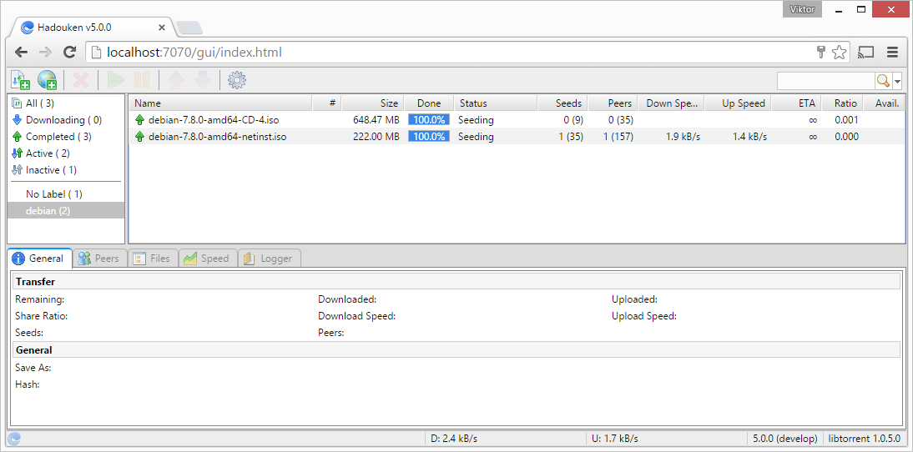

Getting started
===============

Overview
--------

After running the installer, Hadouken can be accessed by pointing your browser
to `http://localhost:7070/gui/index.html <http://localhost:7070/gui/index.html>`_
and entering the username/password you specified during installation.

The default credentials are *admin*/*admin* however it is recommended to change
this.

