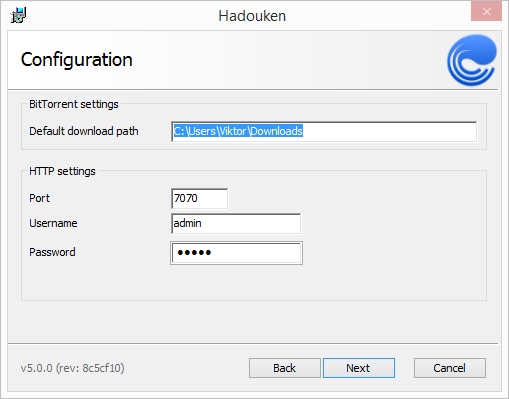

Installing Hadouken on Windows
==============================

Overview
--------

This will guide you through the installation of Hadouken on Windows.

Hadouken runs as a native Windows Service and is only accessible via the
HTTP API it provides. No client application is bundled with the Hadouken
installer.


Getting the installer
`````````````````````

We provide MSI (Windows Installer) files for Hadouken which supports both
attended and unattended installs. The latest installer can be downloaded from
`the build server <https://builds.nullreferenceexception.se/>`_.


Installing
----------

Follow the installation procedure and configure the basic settings as you wish.

It is recommended to enable HTTP authentication since anonymous access will let
anyone control your Hadouken instance.




Unattended installation
-----------------------

Like most well-written MSI packages, Hadouken supports silent/unattended
installation. This is mostly useful in an organization where Hadouken is
deployed to clients through GPO.

These are the parameters you can set,

* :code:`INSTALLDIR` - the installation directory. Defaults to
  :file:`C:/Program Files (x86)/Hadouken`.
* :code:`HDKN_BITTORRENT_SAVE_PATH_REPLACED` - the default save path for
  torrents. Defaults to :file:`%USERPROFILE%/Downloads`.
* :code:`HDKN_DATA_PATH` - the path where Hadouken stores its state data, i.e
  torrents and session state. Defaults to :file:`C:/ProgramData/Hadouken`.
* :code:`HDKN_HTTP_AUTH` - sets which type of HTTP authentication Hadouken
  will use. Valid values are *none*, *basic* and *token*. Defaults to *none*.
* :code:`HDKN_HTTP_PORT` - the HTTP port where the API and event stream will
  listen. Defaults to *7070*.
* :code:`HDKN_HTTP_TOKEN` - the token to use if *Token* authentication is set.
  Default value is an empty string.
* :code:`HDKN_HTTP_BASIC_USERNAME` - the username to use when *Basic*
  authentication is set. Default value is an empty string.
* :code:`HDKN_HTTP_BASIC_PASSWORD` - the password to use when *Basic*
  authentication is set. Default value is an empty string.
